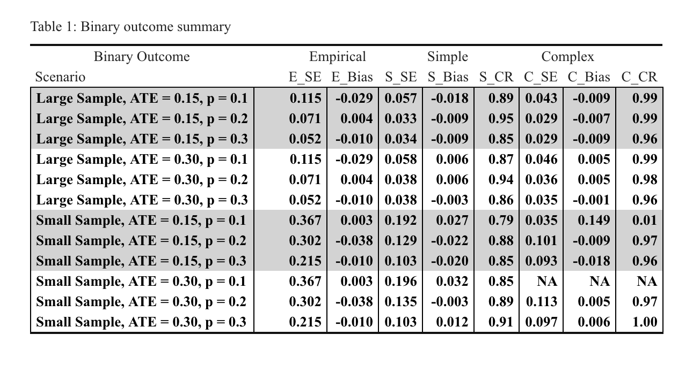
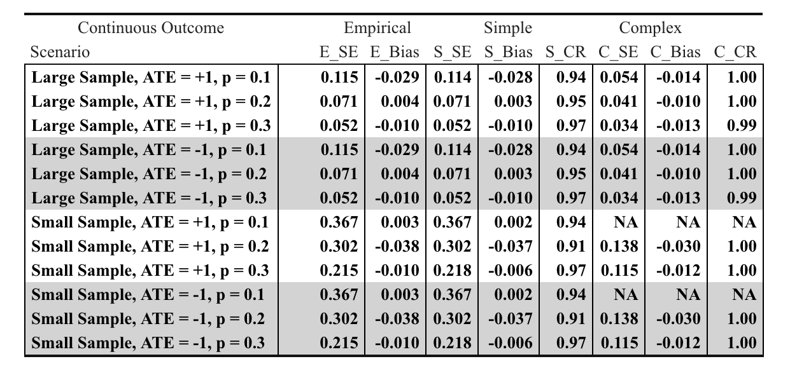

```{r setup, include=FALSE}
knitr::opts_chunk$set(echo = TRUE)
```

```{r, echo=FALSE, message=FALSE, warning=FALSE}
library(dagitty)
library(ggdag)
```

\vspace{75mm}

\begin{center}
{\bf Abstract}
\end{center}

|        When estimating treatment effects via propensity score matching (PSM), it can be difficult to estimate the standard errors of point estimates. Researchers can use conventional bootstrapping techniques toward that aim, but it not obvious if they should re-sample their data before or after matching it. We conduct a simulation study to investigate two bootstrapping procedures to estimate standard errors when measuring treatment effects via nearest-neighbor PSM. In particular, we consider (1) a _simple_ bootstrap procedure in which observations are paired via PSM, data are re-sampled repeatedly, and bootstrapped standard errors are obtained; and (2) a _complex_ bootstrap procedure in which unmatched data are re-sampled repeatedly, observations in each re-sampled dataset are paired via PSM, and bootstrapped standard errors are obtained. We find that when considering a binary outcome of interest, the simple bootstrap tended to underestimate standard errors (thereby increasing the risk of Type I error), but the complex bootstrap performed well. Conversely, when considering continuous outcomes, the simple bootstrap tended to perform well, but the the complex bootstrap tended to overestimate standard errors (thereby increasing the risk of Type II error). Both procedures tend to perform worse in small samples with low treatment prevalence. Overall, we find that the choice of bootstrapping procedure depends on the nature of the outcome variable.

\newpage
# 1. Introduction

## 1.1. Overview

|        In an observational data setting, estimating the average treatment effect (ATE) can be a challenge. In an ideal world, one would conduct a randomized clinical trial (RCT) in which participants are randomized to treatment and control groups, thereby mitigating the effects of any potential confounding variables. Unfortunately, in practice, RCTs can be expensive and operationally infeasible. As such, methods like propensity score matching (PSM) have been developed to obtain unbiased estimates of ATEs in an observational setting. The propensity score is the probability associated with participant treatment assignment given the measured baseline covariates [1]. Matching treated participants with similar untreated participants based on their propensity score can mitigate the bias induced by confounding covariates. In particular this paper will be exploring nearest-neighbor propensity score matching (NNM) using the MatchIt R package [2]. It has been shown that subjects with similar propensity scores will exhibit a similar distribution of measured baseline covariates. However, there are limitations in any given matching method's ability to estimate the variance of the treatment effect [3, 4]. To quantify the variability of estimates around the ATE, researchers can obtain bootstrapped standard errors. Bootstrapping is an estimation procedure that draws many samples (with replacement) from the original dataset to obtain an empirical distribution of estimates. This report will explore two particular bootstrapping methods and their ability to estimate the standard error of the estimated ATE in observational data. 

## 1.2. Objectives

|        The primary goal of this simulation study is to assess the performance of two bootstrapping procedures in estimating the sampling variability of treatment effects obtained from NNM. In this study, NNM selects a treated subject at random from simulated observational data. The untreated subject with the nearest propensity score is then selected to be paired with the treated subject, _without_ replacement. Treatment effects are estimated by comparing average outcomes (continuous or binary) between the treated and untreated subjects. Data are re-sampled pre- or post-matching to obtain bootstrapped standard errors in two different ways; in the former procedure, NNM must be conducted on _each_ bootstrapped re-sample. Once standard errors are obtained, we estimate true coverage rates of the associated confidence intervals to evaluate theses estimates, and hence, the reliability of the bootstrapping procedures themselves.

# 2. Methods

## 2.1. Data Generation

|        The data for this simulation study is generated from a parametric model. As we are focused on observational data, our data generation process is modeled after a hypothetical observational study that could occur in the natural world. For each subject, we generate three normally distributed baseline covariates $L_1, L_2, L_3 \sim N(0, 1)$. Two of these covariates ($L_1$ and $L_2$) determine treatment selection, while two ($L_2$ and $L_3$) affect the outcome (Figure 1). Here, $L_2$ serves as a confounder since it affects both the treatment assignment and outcome. For each subject $i$, the probability of treatment $\pi_i$ is drawn according to the data-generating process
  \[ \text{log}\left(\frac{\pi_i}{1 - \pi_i}\right) = \alpha_0 + \alpha_1 L_{1i} + \alpha_2 L_{2i} \]
where $\alpha_0 \approx \log(\frac{\pi_i}{1-\pi_i})$ serves as a close approximation of desired treatment prevalence.\footnote{Due to the nature of the logit-normal distribution, there is no closed-form computation of the true treatment prevalence. Refer to the mathematical appendix for details.}

|        For continuous outcomes, subject outcomes are generated according to the process
  \[ Y_i = \beta_1 A_i + \beta_2 L_{2i} + \beta_3 L_{3i} + \varepsilon_i, \]
where $Y_i$ indicates the outcome for each subject, $A_i \sim B(\pi_i)$ indicates the binary treatment status of each subject (treated are denoted by $A_i = 1$), $L_{2i}$ and $L_{3i}$ indicate observed covariate values for each subject, and $\varepsilon_i$ denotes random error. Because $L_{2i}$ affects both $A_i$ and $Y_i$, it acts as a confounder in estimating the treatment effect.

|        For binary outcomes, subject outcomes are distributed according to $Y_i \sim B(\tau_i)$, where $\tau_i$ is generated according to the process
  \[ \text{log}\left(\frac{\tau_i}{1 - \tau_i}\right) = \beta_0 + \beta_1 A_i + \beta_2 L_{2i} + \beta_3 L_{3i}. \]
The binary outcome model does not feature an error term, as realizations of $Y_i$ are innately subject to noise.

|        In order to evaluate our simulations, we must establish the true treatment effects. For the continuous case, the true average treatment effect is simply given by $\beta_1$, which is specified _a priori_. For the binary case, computing the true effect is less trivial. In the appendix, we show that
  \[ E(Y \, | \, A = 1) \sim LN \left( \beta_0 + \beta_1, \beta_2^2 + \beta_3^2 \right) \quad \text{and} \]
  \[ E(Y \, | \, A = 0) \sim LN \left( \beta_0, \beta_2^2 + \beta_3^2 \right), \]
where $LN$ denotes the logit-normal distribution. To that end, the true treatment effect can be computed in the same way that we compute the true treatment prevalence.

\vspace{10mm}

\begin{center}
Figure 1. Data Generation Directed Acyclic Graph (DAG)
\end{center}

```{r, echo = FALSE, message = FALSE, fig.width=8, fig.height=3.5, fig.align='center'}
g <- dagitty('dag {
    L1 [pos="1,1"]
    A [pos="1,0"]
    Y [pos="2,0"]
    L2 [pos="1.5,1"]
    L3 [pos="2,1"]
    L1 -> A -> Y 
    A -> Y 
    L2 -> A
    L2 -> Y
    L3 -> Y
}')
ggdag(g)+theme_dag_blank()
```


\newpage

## 2.2. Evaluation

|        We assess two procedures in this simulation: the simple bootstrap and the complex bootstrap.

|        In the simple bootstrap procedure, we draw repeated samples (with replacement) from a post-NNM matched dataset. Here, 500 re-samples ($m_{boot}$) of matched pairs ($n_{boot} = n_{sample} \cdot P(A = 1)$) are drawn from the matched pairs of observations for each of the 100 initial datasets ($m_{sample}$). The distribution of the estimated treatment effect ($\hat{\beta_1}$) across the 500 bootstraps is recorded for each of the 100 initial samples, and the standard deviation of these point estimate serves as our estimate of the standard error ($\hat{\sigma}_{\beta}$).

|        The complex bootstrap considers two additional sources of variability compared to the simple bootstrap. In this approach, a sample is drawn (with replacement) from the original unmatched dataset. Then, we generate a matched dataset for _each_ of the bootstrapped samples via the propensity score algorithm. This process is repeated 500 times for each of the 100 samples, and we obtain our bootstrapped standard error thereafter.

|        Given $\hat{\sigma}_{\beta}$, we can then construct (alleged) 95\% confidence intervals $\hat{\beta_1} \pm 1.96 \hat{\sigma}_{\beta}$. Because we know the true ATE _a priori_, we can then assess the coverage rates of these intervals by recording the fraction of them that contain the true ATE. If the true coverage rate differs significantly from 95\%, then we can conclude that the standard errors were not estimated properly.

\medskip

\begin{center}
Figure 2. High-level Summary of the Simulation
\end{center}

```{tikz, echo = FALSE, fig.align="center"}
\tikzstyle{block} = [rectangle, draw, text width=5em, text centered, rounded corners, minimum height=3em]
\tikzstyle{line} = [draw, -latex]

\begin{tikzpicture}[node distance = 4cm, auto]
    % Place nodes
    \node [block] (gen) {Data Generation};
    \node [block, right of = gen] (init) {Sample i};
    \node [block, above right of = init] (psm0) {PSM};
    \node [block, below right of = init] (bootc) {Bootstrap};
    \node [block, above right of = psm0] (base) {$\hat{\sigma}_\beta^2$};
    \node [block, below right of = psm0] (boots) {Bootstrap};
    \node [block, right of = bootc] (sampc1) {Unmatched Sample 1};
    \node [block, below of = sampc1, yshift = 2.95cm] (sampc2) {Unmatched Sample 2};
    \node [block, below of = sampc2, yshift = 2.95cm] (sampc3) {Unmatched Sample $m_{\text{b}}$};
    \node [block, right of = boots] (samps1) {Matched Sample $m_{\text{b}}$};
    \node [block, above of = samps1, yshift = -2.95cm] (samps2) {Matched Sample 2};
    \node [block, above of = samps2, yshift = -2.95cm] (samps3) {Matched Sample 1};
    \node [block, right of = samps2] (simp) {$\hat{\sigma}_\beta^2$};
    \node [block, right of = sampc1] (psm1) {PSM};
    \node [block, right of = sampc2] (psm2) {PSM};
    \node [block, right of = sampc3] (psm3) {PSM};
    \node [block, right of = psm2] (comp) {$\hat{\sigma}_\beta^2$};
    % Draw edges
    \path [line] (gen) -- (init);
    \path [line] (init) -- (psm0);
    \path [line] (init) -- node {Complex}(bootc);
    \path [line] (psm0) -- node {Empirical}(base);
    \path [line] (psm0) -- node {Simple}(boots);
    \path [line] (boots) -- (samps1);
    \path [line] (boots) -- (samps2);
    \path [line] (boots) -- (samps3);
    \path [line] (bootc) -- (sampc1);
    \path [line] (bootc) -- (sampc2);
    \path [line] (bootc) -- (sampc3);
    \path [line] (sampc1) -- (psm1);
    \path [line] (sampc2) -- (psm2);
    \path [line] (sampc3) -- (psm3);
    \path [line] (samps1) -- (simp);
    \path [line] (samps2) -- (simp);
    \path [line] (samps3) -- (simp);
    \path [line] (psm1) -- (comp);
    \path [line] (psm2) -- (comp);
    \path [line] (psm3) -- (comp);
    %
    \node [yshift = -2.50cm, xshift = 1.75cm] (text) {$i \in \{ 1, \ldots, m_{\text{s}} \}$};
    \draw[black, ->] (text) + (80:2.25cm) arc(80:-260:1cm);
\end{tikzpicture}
```

## 2.3. Parameters of Interest 

|        We allow three parameters to vary across different simulations: dataset sample size ($n_{\text{sample}}$), population proportion of treated individuals ($E(\pi_i)$) and the true average treatment effect ($\beta_1$). Varying the sample size and proportion of treated individuals enable us to simulate real-world scenarios, such as studies with small-sample datasets or low treatment prevalence. In particular, we consider $n_{\text{sample}} \in \{ 100, 1000 \}$, $E(\pi_i) \in \{ 0.113, 0.216, 0.313 \}$, $E(Y^{a = 1}) - E(Y^{a = 0}) \in \{0.15, 0.30 \}$ (for binary outcomes), and $\beta_1 \in \{-1, 1 \}$ (for continuous outcomes).

|        While the above parameters can vary, we also consider several static parameters: the number of datasets ($m_{\text{sample}} = 100$), the number of bootstrapped re-samples ($m_{\text{boot}} = 500$), the effect size of covariates on the treatment proportion ($\alpha_1 = \log(1.25), \alpha_2 = \log(1.75)$), and the effect size of covariates on the outcome ($\beta_2, \beta_3$). For continuous outcomes, we set $\beta_2 = 2$ and $\beta_3 = 1$; for binary outcomes, we set $\beta_2 = \log(1.75), \beta_3 = \log(1.25)$.

## 2.4. Performance Measures

|        The standard error estimates from each bootstrap method are assessed in two ways. First, as previously mentioned, we compare advertised coverage rates to true coverage rates. Second, we compare standard error estimates from each bootstrap method to the sample standard deviation of treatment effects of the initial samples to assess how bootstrapping aligns with a simpler approach.

|        We also compute bias using the true treatment effect. This measure helps confirm that each method is able to accurately identify the treatment effect. A 95\% percent confidence interval is also constructed around the bias using the bootstrapped standard error. 

# 3. Simulation Execution

|        As this simulation study contained many different components, several options were proposed to maintain program tidiness. It was ultimately determined that it would be best to divide the code into individual RMarkdown and/or RScript files along outcome type. Each of these files would define, collate, and/or execute the particular simulation scenarios of interest.

|        First, RScript files containing data generation functions for each outcome type were constructed. These scripts would not only generate the initial datasets of interest (according to algorithms defined previously) but also a vector drawn from a uniform distribution to provide the seeds needed to run future sampling procedures. A seed was set at the beginning of this script file in order for the results of this simulation study to be reproducible. [Appendix A]

|        Bootstrapping functions were then defined, in which separate procedures were written for simple bootstrapping and complex bootstrapping. Since the simple bootstrap samples from a dataset in which propensity score matched pairs had already been created, its function only needed to perform the sampling-with-replacement procedure. [Appendix B] In the function written to handle complex bootstrapping, a matching procedure was included after the sampling-with-replacement step. [Appendix C] Both of these functions were written to perform all iterations of bootstrapping required for each initial dataset (i.e., $m_{boot}$ samples would be produced for each base sample).

|        Outcome functions were then constructed to produce the estimated treatment effect we were interested in. In these outcome functions, bootstrapped samples were passed through the GLM function, and we use standardization to estimate the average treatment effect of the entire study population. To this end, the pseudo-population is created where every subject gets treatment and no treatment for each sub-population and we use GLM model to obtain estimated treatment effect from bootstrapped samples. [Appendix D] Then, these estimates were summarized and collected in datasets that were indexed by scenario, outcome type, and bootstrapping method. 

|        Finally, these functions were compiled into scripts we could pass parameters into and run through top-to-bottom to generate the results for a given scenario. To avoid manually updating the parameters that would vary, a dataset was established to describe the scenarios of interest in the study. [Appendix E] These final programs would read in the specified row of parameters and conduct the full simulation based on those values. 

|        Some excerpts of the programming associated with this simulation study has been included in the Appendix. All programs are available in [\underline{this GitHub repository}](https://github.com/tucker-l-morgan/p8160_proj1_4_C).

# 4. Results

```{r cvg rate plots, echo = FALSE, message = FALSE, warning = FALSE}
library(tidyverse)
source("./shared_code/bin_plots_script.R")
source("./shared_code/cont_plots_script.R")
bin_cvg_plot + labs(title = "Figure 3: Binary Coverage Rates") + theme(text = element_text(size = 10))
cont_cvg_plot + labs(title = "Figure 4: Continuous Coverage Rates") + theme(text = element_text(size = 10))
```

|        Analysis was performed on 24 different scenarios, 12 in a binary outcome setting and 12 in a continuous setting. To assess the standard error estimates produced by each bootstrapping method, confidence intervals were created and coverage rates calculated, see Figures 2 and 3. Each of our scenarios included 100 initial, base samples, which resulted in 100 confidence intervals. Based on the binomial distribution where n = 100, p = 0.95, a coverage rate below 90% and above 99% indicates a statistically significant under- or over-estimation of the standard error. Based on this criteria, the simple bootstrap method underestimated the standard error in five out of the six binary outcome scenarios with a lesser true average treatment effect, and the simple bootstrap underestimated the standard error of the true average treatment effect in four of the six of the scenarios involving the larger treatment effect. Conversely, the complex bootstrap method overestimated the standard error in one of the 11 scenarios. Note the complex bootstrapping method was not reliable in the scenario where $n_{sample} = 100$ and treated proportion was equal to 10%. In the scenario with a lesser treatment effect, the complex bootstrap produced a 1% coverage rate, and no estimate was produced for the scenario with a greater treatment effect.

|        In the continuous setting (Figure 3), the coverage rate from the simple bootstrapping method fell within the statistically significant range for all 12 scenarios. However, the complex bootstrap overestimated the standard error in 10 of the 12 scenarios. Again, the complex bootstrap was not reliable in the two scenarios where $n_{sample} = 100$ and treated proportion was equal to 10%. No estimates were produced in these instances due to sampling error wherein the bootstrapped sample contained no treated individuals, and thus no propensity score matching or treatment effect estimation could take place.

```{r standard error plots, echo = FALSE, message = FALSE, warning = FALSE}
bin_se_plot + labs(title = "Figure 5: Binary Standard Error Estimates") + theme(text = element_text(size = 10))
cont_se_plot + labs(title = "Figure 6: Continuous Standard Error Estimates") + theme(text = element_text(size = 10))
```

|        In Figure 4, the standard error estimates from the binary setting can be seen in more detail. In general, the simple bootstrap seemed to produce lower estimates of standard error compared to an empirical estimate based on the initial sample distribution before any bootstrapping, while the complex bootstrap seems to produce larger estimates of the standard error. This aligns with the observation that the complex bootstrap confidence intervals tended to have higher coverage rates compared to the simple bootstrap method. Note again the exception for complex bootstrapping for the scenario with only 100 subjects and 10% treatment proportion.

|        In Figure 5, a similar plot features the standard error estimates from the continuous setting. Again, the estimates from the two bootstrapping methods and the empirical measurement produce similar values. In general, the complex bootstrap produces larger estimates of standard error compared to the simple bootstrap, but the scenario in which $n_{sample} = 1000$ and treated proportion is 30% has a smaller simple bootstrap estimate compared to the complex bootstrap. These results are summarized in detail in Table 1 and Table 2. In general, standard error estimates appear to converge as sample size increases.

```{r bias plots, echo = FALSE, message = FALSE, warning = FALSE}
bin_bias_plot + labs(title = "Figure 7: Binary Bias Distributions") + theme(text = element_text(size = 10))
cont_bias_plot + labs(title = "Figure 8: Continuous Bias Distributions") + theme(text = element_text(size = 10))
```

|        Additional analysis was performed on the bias demonstrated in each of the bootstrap methods and the empirical calculation. In Figures 6 and 7, the mean and standard deviation of the bias (the difference between the estimated and true average treatment effect) are shown for all three methods in the binary and continuous settings, respectively. The standard deviation of bias increases as the number of initial samples ($n_{sample}$) decreases. These results are summarized in detail in Tables 1 and 2.

|        The two tables below summarize the results of all the plots above (Figure 3 - Figure 8). These tables include the standard deviation and bias of the empirical samples, 100 sub-populations before performing the simple bootstrap (Figure 1). 


$\\$




\newpage

# 5. Discussion

## 5.1. Summary of Findings

|        In summary, the simple bootstrap method tended to have smaller standard error estimates compared to the complex bootstrap method overall and to underestimate the sampling variability of the treatment effect for binary outcomes. As we can see from our 95% confidence interval coverage rate plots, the simple bootstrap tended to have less conservative type I error rate than 0.05 whereas the complex bootstrap tended to have more conservative type I error rate than 0.05. As a result, using the complex bootstrap tended to decrease the statistical power. However, differences were less pronounced in settings with larger sample sizes and higher treatment prevalence. Based on the results of this study, it is recommended to use the simple bootstrap method for continuous data, as the complex bootstrap confidence intervals typically had statistically significantly high coverage rates. For binary data, it is recommended to use the complex bootstrap, particularly in settings with larger sample sizes. The simple bootstrap tended to produce statistically significantly low coverage rates for binary data. Notably, the complex bootstrap was not a reliable method in a setting with small sample size and low treatment prevalence (n = 100, 10% treatment).

## 5.2. Limitations

|        One drawback of this study was a lack of sample size plurality. It would be beneficial to understand the performance of these methods in settings with larger sample sizes (e.g., 5,000 or 10,000 subjects). This was unfortunately too computationally intensive for this study. Another limitation was the number of initial samples made. In the procedures above, a set of 100 initial samples was taken. Each sample resulted in one confidence interval, which was the primary method of assessing standard error estimates. With only 100 confidence intervals, the statistically insignificant range for coverage rate was larger than would be ideal. Running the same procedures with 1,000 initial samples would allow for a narrower range of acceptable coverage rates, yielding more power to detect differences between methods.

## 5.3. Next Steps and Future Research

|        Similar studies in the future could focus on improving some of the limitations mentioned above. In particular, working with a larger number of initial samples and larger sample sizes would give more insight into how well the simple and complex bootstrap methods estimate standard error. As detailed above, the data generation and treatment assignment models are relatively simple with standard normally distributed covariates. Covariate correlations were also held constant in each of the simulated scenarios. It is recommended that these methods be studied in settings with varying parametric or non-parametric data to further understand their performance.

## 5.4. Group Contributions

|        Each group member made equal contributions to this project, and we all worked hard to produce a project we could be proud of. We began the process through frequent in-person group meetings to talk through concepts and to design the simulation at a high level. Once we had a firm grasp on our goals, Waveley and Hun worked on writing the code for the binary outcome scenario and the two bootstrap procedures. Tucker worked on writing the code for the continuous outcome scenario, and he also worked on drafting the report. Amy worked on the data-generation process, generating charts to output results, and writing the report. Jimmy worked on writing the presentation and deriving mathematical results for the simulation. We also continually revised each other's contributions to ensure consistency and to gain a deeper understanding of the material. 


\newpage

# References 

\begin{enumerate}[label={[\arabic*]}]
  \item  Rosenbaum, P. R. und DB Rubin 1983.“The Central Role of the Propensity Score in Observational Studies for Causal Effects”. Biometrika, 70(1), 1-55
  \item Ho, D., Imai, K., King, G., Stuart, E., \& Whitworth, A. (2018). Package ‘MatchIt’
  \item Schafer, J. L., \& Kang, J. (2008). Average causal effects from nonrandomized studies: a practical guide and simulated example. Psychological methods, 13(4), 279.
  \item  Austin, P. C., \& Small, D. S. (2014). The use of bootstrapping when using propensity‐score matching without replacement: a simulation study. Statistics in medicine, 33(24), 4306-4319.
\end{enumerate}


\newpage

# Mathematical Appendix

Recall that $\pi$ denotes the true proportion of the treated. In the binary outcome setting, let $\tau^{a = 1}$ and $\tau^{a = 0}$ denote the true probabilities of a successful outcome among the treated and untreated, respectively. We aim to show that $\pi$, $\tau^{a = 1}$, and $\tau^{a = 0}$ are the means of logit-normally distributed random variables.

For convenience, let $\mathcal{L} : \mathbb{R} \to [0, 1]$ be the standard logistic function given by
  \[ \mathcal{L}(x) = \frac{e^x}{1 + e^x}. \]
By the law of iterated expectation, we obtain
  \begin{align*}
    \pi
    &= E(A) \tag{by definition of $\pi$} \\[8pt]
    &= E \Big( E(A \, | \, L_1, L_2) \Big) \tag{by iterated expectation} \\
    &= E \left( \frac{e^{\alpha_0 + \alpha_1 L_1 + \alpha_2 L_2}}{1 + e^{\alpha_0 + \alpha_1 L_1 + \alpha_2 L_2}} \right) \tag{by definition of $A$} \\
    &= E \Big( \mathcal{L}(\alpha_0 + \alpha_1 L_1 + \alpha_2 L_2) \Big) \tag{by definition of $\mathcal{L}$}.
  \end{align*}
Indeed, as $L_1, L_2 \sim N(0, 1)$, it follows that $\alpha_0 + \alpha_1 L_1 + \alpha_2 L_2 \sim N(\alpha_0, \alpha_1^2 + \alpha_2^2)$. In particular, $\pi$ is the mean of a logit-normally distributed random variable. To see that $\tau^{a = 1}$ is logit-normally distributed, observe that
  \begin{align*}
    \tau^{a = 1}
    &= E(Y \, | \, A = 1) \tag{by definition of $\tau^{a = 1}$} \\[8pt]
    &= E \Big( E(Y \, | \, A, L_2, L_3) \, | \, A = 1 \Big) \tag{by iterated expectation} \\[4pt]
    &= E \left( \frac{e^{\beta_0 + \beta_1 A + \beta_2 L_2 + \beta_3 L_3}}{1 + e^{\beta_0 + \beta_1 A + \beta_2 L_2 + \beta_3 L_3}} \, \middle| \, A = 1 \right) \tag{by definition of $Y$} \\
    &= E \left( \frac{e^{\beta_0 + \beta_1 + \beta_2 L_2 + \beta_3 L_3}}{1 + e^{\beta_0 + \beta_1 + \beta_2 L_2 + \beta_3 L_3}} \right) \tag{by conditioning} \\[4pt]
    &= E \Big( \mathcal{L}(\beta_0 + \beta_1 + \beta_2 L_2 + \beta_3 L_3) \Big) \tag{by definition of $\mathcal{L}$}.
  \end{align*}
As $L_2, L_3, \sim N(0, 1)$, it follows that $\beta_0 + \beta_1 + \beta_2 L_2 + \beta_3 L_3 \sim N(\beta_0 + \beta_1, \beta_2^2 + \beta_3^2)$. In particular, $\tau^{a = 1}$ is the mean of a logit-normally distributed random variable, as well. The argument for $\tau^{a = 0}$ proceeds analogously.

Given a random variable $X \sim N(\mu, \sigma^2)$ and $Y \equiv \mathcal{L}(X)$, the mean of $Y$ can be computed via
  \[ E(Y) = \lim_{n \to \infty} \frac{1}{n} \sum_{i = 1}^n \mathcal{L} \left(\Phi_{\mu, \sigma^2}^{-1}\left(\frac{i}{n + 1}\right)\right), \]
where $\Phi_{\mu, \sigma^2}$ denotes the CDF of $X$. By considering a large value of $N \in \mathbb{N}$, the truncation of the above limit
  \[ \frac{1}{N} \sum_{i = 1}^N \mathcal{L} \left(\Phi_{\mu, \sigma^2}^{-1}\left(\frac{i}{N + 1}\right)\right) \]
serves as an efficient Monte Carlo estimate of the true mean of $Y$. This is preciseely how we estimate the true proportion of treated $\pi$ and the true risk difference $\tau^{a = 1} - \tau^{a = 0}$ given our _a priori_ choices of parameter vector $(\alpha, \beta)$.


\newpage

# Coding Appendices

## Appendix A: Seed Vector

```{r, eval=FALSE}
set.seed(20220217)

seed_vec <- runif(100000, min = 100, max = 99999999) %>% round(0) %>% unique()
```

\newpage

## Appendix B: Simple Bootstrap, Binary Outcome

```{r}
simple_boot <- function(df, n = m_boot, size = df %>% pull(A) %>% sum(), seeds = seed_vec){
  boots <- list()
  for (i in 1:n) {
    set.seed(seeds[i])
    boots[[i]] <- 
      df %>% 
      filter(subclass %in% sample(levels(subclass), 
                                  size, 
                                  replace =  TRUE))
  }
  return(boots)
}
```

\newpage

## Appendix C: Complex Bootstrap, Binary Outcome

```{r, eval=FALSE}
generate_boots <- function(df, iter = m_boot, seeds = seed_vec){
  
  boot_samples <- list()
  matched_boot_df <- list()
  boot_results <- tibble()
  
  for (i in 1:iter) {
    set.seed(seeds[[i]])
    
    boot_samples[[i]] <- sample_n(df, nrow(df), replace = TRUE)
    
    matched <- matchit(A ~ L2 + L3, data = boot_samples[[i]], 
                       distance = "glm", link = "logit",
                       method = "nearest", ratio = 1)
    
    matched_boot_df[[i]] <- match.data(matched, distance = "ps")
  }
  
  return(matched_boot_df)
}
```

\newpage

## Appendix D: Outcome Function, Binary Outcome

```{r, eval=FALSE}
outcome_model_list <- function(list) {
  tib_coef <- tibble()
  boots <- tibble(mean1 = NA,
                  mean0 = NA,
                  difference = NA)
  for (i in 1:length(list)) {
    mod <- glm(Y ~ A + ps, 
               data = list[[i]], 
               weights = weights, 
               family = "binomial")
    
    sampl_all_treated <- 
      list[[i]] %>%
      mutate(A = 1)
    
    sampl_all_untreated <- 
      list[[i]] %>%
      mutate(A = 0)
    
    sampl_all_treated$pred.y <- 
      predict(mod, sampl_all_treated, type = "response")
    
    sampl_all_untreated$pred.y <- 
      predict(mod, sampl_all_untreated, type = "response")
    
    boots[i, "mean1"] <- mean(sampl_all_treated$pred.y)
    boots[i, "mean0"] <- mean(sampl_all_untreated$pred.y)
    boots[i, "difference"] <- boots[i, "mean1"] - boots[i, "mean0"]
  }
  return(boots)
}
```

\newpage

## Appendix E: Parameter Setting, Scenario 1

```{r, eval=FALSE}
scenario_id <- 1

all_scenarios <- tibble(
  id = c(1:18),
  n_sample = c(rep(1000, 6), rep(10000, 6), rep(100, 6)),
  desired_prop = rep(c(0.1, 0.1, 0.2, 0.2, 0.3, 0.3),3),
  beta1 = rep(c(0.767,  1.386294), 9),
  beta0 = rep(c(0.422, -1.069315, 0.46, -1.138629, 0.499, -1.207944), 3)
)

desired_prop = all_scenarios %>% filter(id == scenario_id) %>% pull(desired_prop)
alpha1   = log(1.25)
alpha2   = log(1.75)
beta0    = all_scenarios %>% filter(id == scenario_id) %>% pull(beta0)
beta1    = all_scenarios %>% filter(id == scenario_id) %>% pull(beta1)
beta2    = log(1.75)
beta3    = log(1.25)
m_sample = 100
m_boot   = 500
n_sample = all_scenarios %>% filter(id == scenario_id) %>% pull(n_sample)
```

