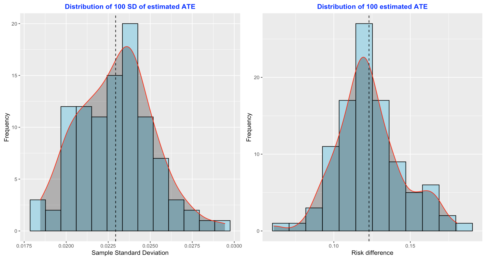

```{r setup, include=FALSE}
knitr::opts_chunk$set(echo = TRUE)
```

## Motivation

>- Identifying the effect of a treatment, exposure, or intervention is one of the most fundamental tasks we encounter as biostatisticians...
 
>- ... but outside of a randomized control trial (RCT), confounding variables can bias our estimates of treatment effects.
 
>- Propensity score matching (PSM) is a tool that can help us mitigate the effects of confounders...
 
>- ... but there is no consensus on the best way to estimate standard errors when using the PSM algorithm.
 
>- How can we assess which procedures reliably estimate standard errors?

## Motivation

\begin{center}
  A simulation study!
\end{center}

## A Quick Foray into Confounding

```{tikz, echo = FALSE, fig.align = "center"}
\tikzstyle{block} = [circle, draw, text width=5em, text centered, minimum height=1em]
\tikzstyle{line} = [draw, -latex]

\begin{tikzpicture}[node distance = 4cm, auto]
    % Place nodes
    \node [block] (A) {Treatment $A$};
    \node [block, above of = A] (L) {Confounder $L$};
    \node [block, right of = A] (Y) {Outcome $Y$};
    % Draw edges
    \path [line] (L) -- (A);
    \path [line] (L) -- (Y);
    \path [line] (A) -- (Y);
\end{tikzpicture}
```

## A (Yet) Quick(er) Foray into Propensity Score Matching

> (1) We start with an unmatched dataset.

> (2) We estimate the propensity score - the probability of treatment given some set of covariates - according to some pre-specified model fitting (e.g., logistic regression).

> (3) We pair treated and untreated indiviuals who have similar propensity scores according to some pre-specified matching algorithm (e.g., nearest neighbors).

> (4) We end with a matched dataset.

## Enter the Bootstrap

>- Bootstrapping is one of the most common procedures for estimating standard errors.

>- The PSM algorithm intakes an unmatched dataset and outputs a matched one.

>- __Primary Research Question:__ When do we execute the bootstrap - before the match or after it?

>- Let's try both!


<!-- Hun  -->

## Roadmap of the Simulation Study

```{tikz, echo = FALSE, fig.align = "center"}
\tikzstyle{block} = [rectangle, draw, text width=5em, text centered, rounded corners, minimum height=3em]
\tikzstyle{line} = [draw, -latex]

\begin{tikzpicture}[node distance = 4cm, auto]
    % Place nodes
    \node [block] (gen) {Data Generation};
    \node [block, right of = gen] (init) {Sample i};
    \node [block, above right of = init] (psm0) {PSM};
    \node [block, below right of = init] (bootc) {Bootstrap};
    \node [block, above right of = psm0] (base) {$\hat{\sigma}_\beta^2$};
    \node [block, below right of = psm0] (boots) {Bootstrap};
    \node [block, right of = bootc] (sampc1) {Unmatched Sample 1};
    \node [block, below of = sampc1, yshift = 2.95cm] (sampc2) {Unmatched Sample 2};
    \node [block, below of = sampc2, yshift = 2.95cm] (sampc3) {Unmatched Sample $m_{\text{b}}$};
    \node [block, right of = boots] (samps1) {Matched Sample $m_{\text{b}}$};
    \node [block, above of = samps1, yshift = -2.95cm] (samps2) {Matched Sample 2};
    \node [block, above of = samps2, yshift = -2.95cm] (samps3) {Matched Sample 1};
    \node [block, right of = samps2] (simp) {$\hat{\sigma}_\beta^2$};
    \node [block, right of = sampc1] (psm1) {PSM};
    \node [block, right of = sampc2] (psm2) {PSM};
    \node [block, right of = sampc3] (psm3) {PSM};
    \node [block, right of = psm2] (comp) {$\hat{\sigma}_\beta^2$};
    % Draw edges
    \path [line] (gen) -- (init);
    \path [line] (init) -- (psm0);
    \path [line] (init) -- node {Complex}(bootc);
    \path [line] (psm0) -- node {Baseline}(base);
    \path [line] (psm0) -- node {Simple}(boots);
    \path [line] (boots) -- (samps1);
    \path [line] (boots) -- (samps2);
    \path [line] (boots) -- (samps3);
    \path [line] (bootc) -- (sampc1);
    \path [line] (bootc) -- (sampc2);
    \path [line] (bootc) -- (sampc3);
    \path [line] (sampc1) -- (psm1);
    \path [line] (sampc2) -- (psm2);
    \path [line] (sampc3) -- (psm3);
    \path [line] (samps1) -- (simp);
    \path [line] (samps2) -- (simp);
    \path [line] (samps3) -- (simp);
    \path [line] (psm1) -- (comp);
    \path [line] (psm2) -- (comp);
    \path [line] (psm3) -- (comp);
    %
    \node [yshift = -2.50cm, xshift = 1.75cm] (text) {$i \in \{ 1, \ldots, m_{\text{s}} \}$};
    \draw[black, ->] (text) + (80:2.25cm) arc(80:-260:1cm);
\end{tikzpicture}
```

## An Example of a Single Bootstrap Sample




<!-- Waveley  -->

## Data Generation

```{tikz, echo = FALSE, fig.align = "center"}
\tikzstyle{block} = [circle, draw, text width=5em, text centered, minimum height=1em]
\tikzstyle{line} = [draw, -latex]

\begin{tikzpicture}[node distance = 4cm, auto]
    % Place nodes
    \node [block] (L1) {$L_1$};
    \node [block, right of = L1] (L2) {$L_2$};
    \node [block, right of = L2] (L3) {$L_3$};
    \node [block, below of = L2] (A) {$A$};
    \node [block, below of = L3] (Y) {$Y$};
    % Draw edges
    \path [line] (L1) -- (A);
    \path [line] (L2) -- (A);
    \path [line] (L2) -- (Y);
    \path [line] (L3) -- (Y);
    \path [line] (A) -- (Y);
\end{tikzpicture}
```

## Data Generation - Continuous Outcome

For each individual $i \in \{ 1, \ldots, n \}$, we consider covariates $L_{1i}, L_{2i}, L_{3i} \sim N(0, 1)$. Treatments are distributed according to law $A_i \sim B(\pi_i)$, where $\pi_i$ - the true propensity to be treated - is subject to the data-generating process
  \[
    \log \left( \frac{\pi_i}{1 - \pi_i} \right)
    = \alpha_0 + \alpha_1 L_{1i} + \alpha_2 L_{2i}.
  \]
Given this, we further define the data-generating process of our continuous outcome via
  \[ Y_i = \beta_1 A_i + \beta_2 L_{2i} + \beta_3 L_{3i} + \varepsilon_i, \]
where $\varepsilon_i$ denotes random error. Because $L_{2i}$ effects both $A_i$ and $Y_i$, it acts as a confounder in estimating the treatment effect.

## Data Generation - Binary Outcome

For each individual $i \in \{ 1, \ldots, n \}$, we consider covariates $L_{1i}, L_{2i}, L_{3i} \sim N(0, 1)$. Treatments are distributed according to law $A_i \sim B(\pi_i)$, where $\pi_i$ - the true propensity to be treated - is subject to the data-generating process
  \[
    \log \left( \frac{\pi_i}{1 - \pi_i} \right)
    = \alpha_0 + \alpha_1 L_{1i} + \alpha_2 L_{2i}.
  \]
Given this, we further define the data-generating process of our binary outcome via $Y_i \sim B(\tau_i)$ where
  \[
    \log \left( \frac{\tau_i}{1 - \tau_i} \right)
    = \beta_0 + \beta_1 A_i + \beta_2 L_{2i} + \beta_3 L_{3i}.
  \]
Observe that we have omitted a random error term, as realizations of our binary $Y_i$ are innately subject to noise.


<!-- Amy  -->

## Parameters of Interest

- The sample size of each dataset $n_{\text{sample}} \in \{ 100, 1000 \}$
- The population proportion of treated individuals $\pi \in \{ 0.113, 0.216, 0.313 \}$
- The true average treatment effect $\beta_1 \in \{0.15, 0.30 \}$ for binary data; $\beta_1 \in \{-1, 1 \}$ for continuous data

_Other Parameters_

- The number of datasets $m_{\text{sample}} = 100$
- The number of bootstrap re-samples $m_{\text{boot}} = 500$
- The sample size of bootstrap re-samples $n_{\text{simple}} = n_{\text{complex}} = n_{\text{sample}}\times \pi$
- Strength of covariate effect on treatment $\alpha_1 = \log(1.25), \alpha_2 = \log(1.75)$
- Strength of covariate effect on outcome $\beta_2 = \log(1.75), \beta_3 = \log(1.25)$

## Measures of Interest

- \textbf{Standard Error:} The variability of the average estimate of the treatment effect ($\text{SE}(\hat{\beta}_1)$).
- \textbf{Coverage Rate:} The fraction of alleged 95\% confidence intervals ($\hat{\beta}_1 \pm 1.96 \times \text{SE}(\hat{\beta}_1)$) that contain the true treatment effect

_Other Measures_

- \textbf{Bias:} The mean of the average estimate ($\hat{\beta}_1$) less the true treatment effect ($\beta$)

## Results - Binary Outcome

```{r loading_in_binary_coverage_plot, echo = FALSE, message = FALSE, warning = FALSE}
library(tidyverse)
source("./shared_code/bin_plots_script.R")
bin_cvg_plot
```

## Results - Binary Outcome
```{r binary_standard_error_plot, echo = FALSE, message = FALSE, warning = FALSE}
bin_se_plot
```

## Results - Continuous Outcome

```{r continuous_coverage_plot, echo = FALSE, message = FALSE, warning = FALSE}
source("./shared_code/cont_plots_script.R")
cont_cvg_plot
```

## Results - Continuous Outcome

```{r continous_standard_error_plot, echo = FALSE, message = FALSE, warning = FALSE}
cont_se_plot
```

## Summary of Results

- For binary outcomes, the simple bootstrap tended to underestimate the standard error

- Larger standard error estimates from complex bootstrap in binary and continuous settings

- Differences between simple and complex bootstrap were smaller for larger sample sizes

- Complex bootstrap not as reliable in small sample sizes

## Limitations

- Sample size / treatment (or exposure) prevalence

- Small number of initial samples, limited in detecting significant differences in coverage rate


## Future Work

- Larger number of initial samples, narrower coverage window

- Increased sample size, changes in bootstrap performance?

- Changes in treatment propensity model

- Non-normal distributions of covariates